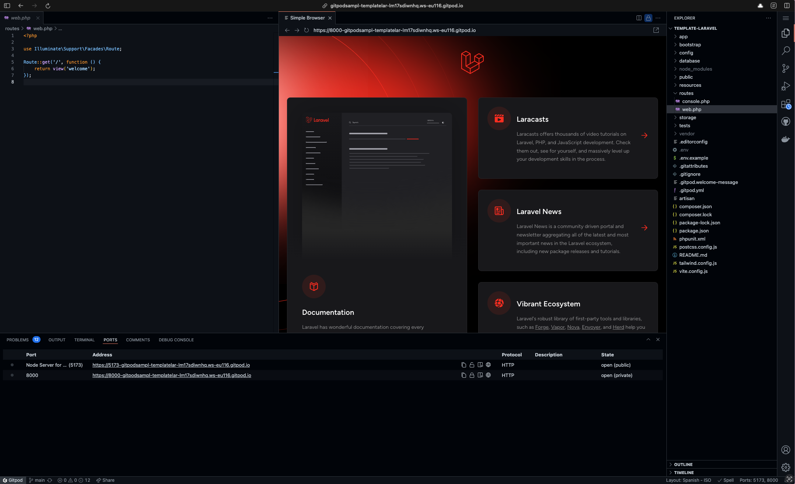

# Laravel template on Gitpod

This is a [Laravel](https://laravel.com) template configured for ephemeral development environments on [Gitpod](https://www.gitpod.io/).

## Next Steps

Click the button below to start a new development environment:

## Get Started With Your Own Project

### A new project

Click the above "Open in Gitpod" button to start a new workspace. Once you're ready to push your first code changes, Gitpod will guide you to fork this project so you own it.

### An existing project

To get started with Laravel with MySQL on Gitpod, add a [`.gitpod.yml`](./.gitpod.yml) file which contains the configuration to improve the developer experience on Gitpod. To learn more, please see the [Getting Started](https://www.gitpod.io/docs/getting-started) documentation.
